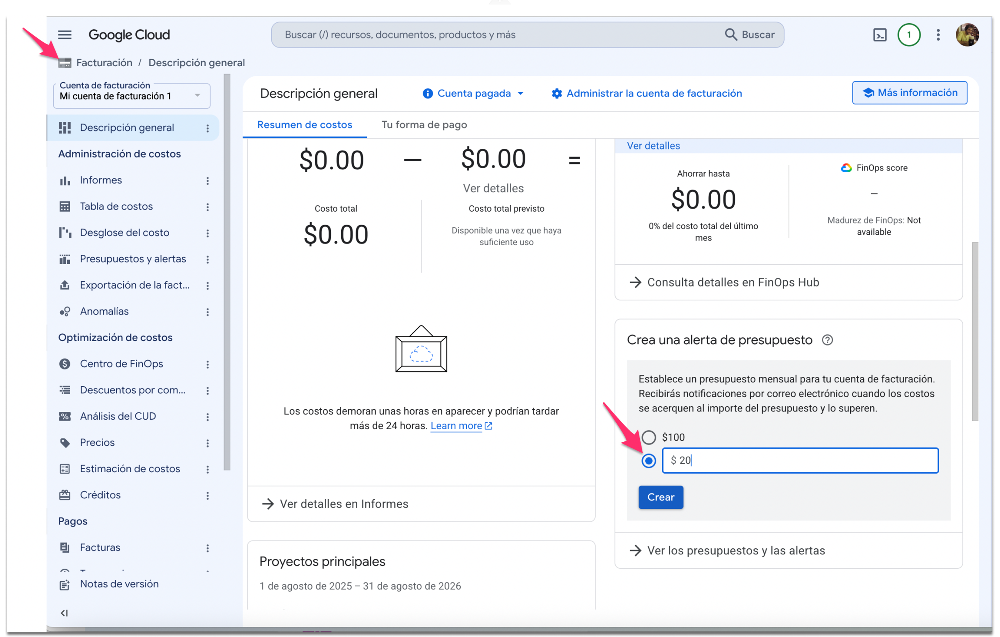
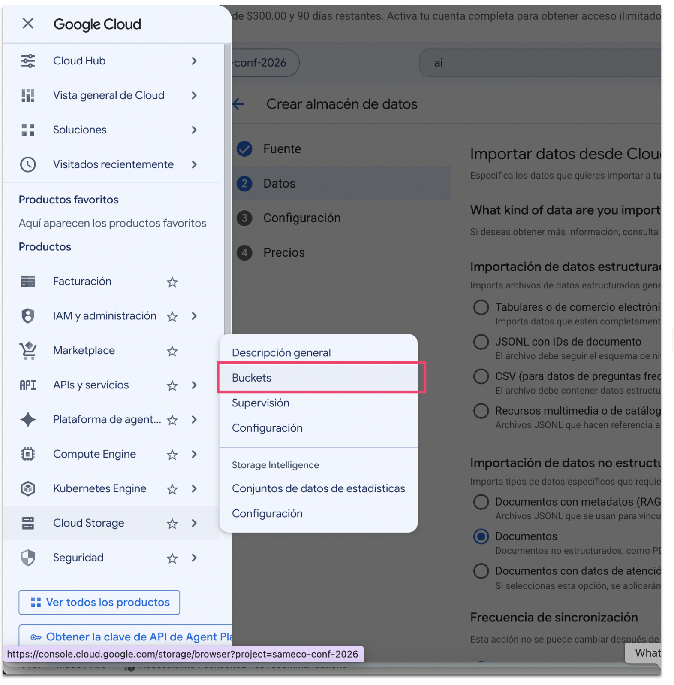
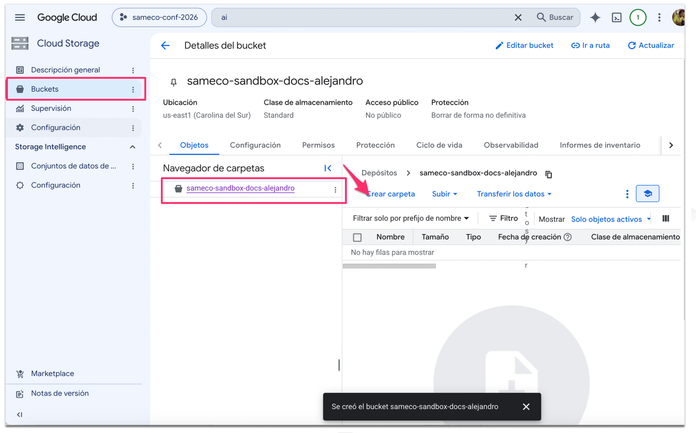
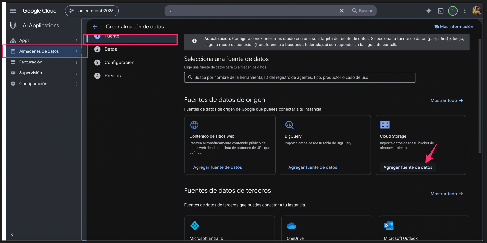
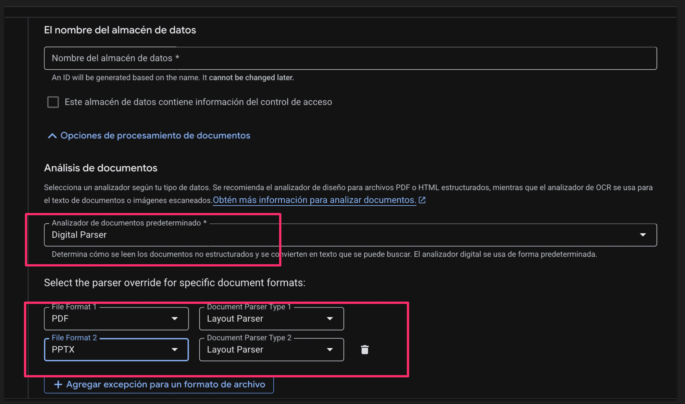
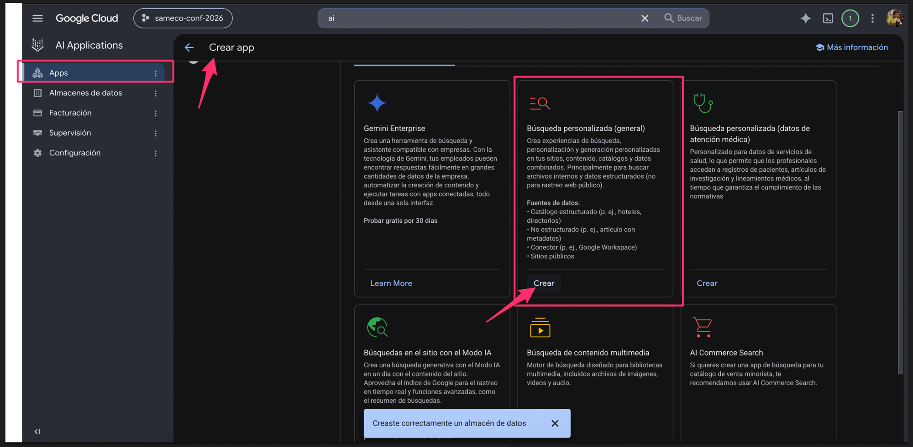
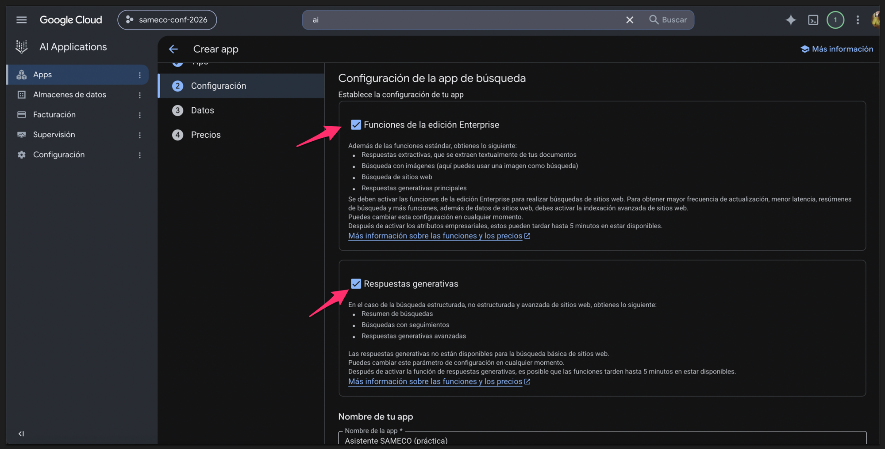
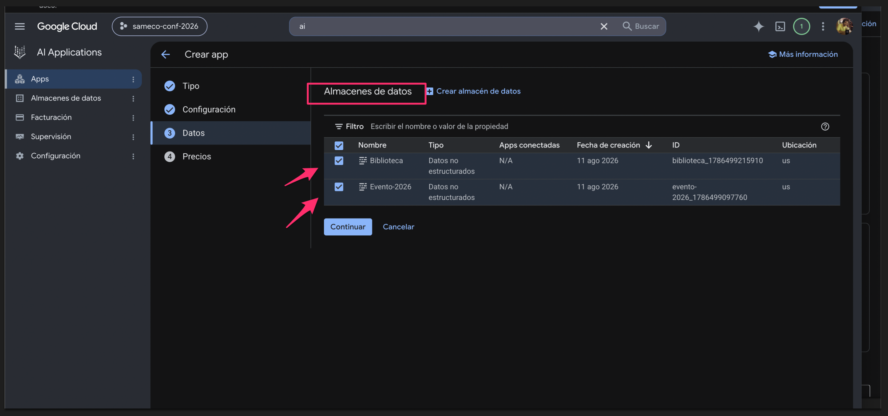
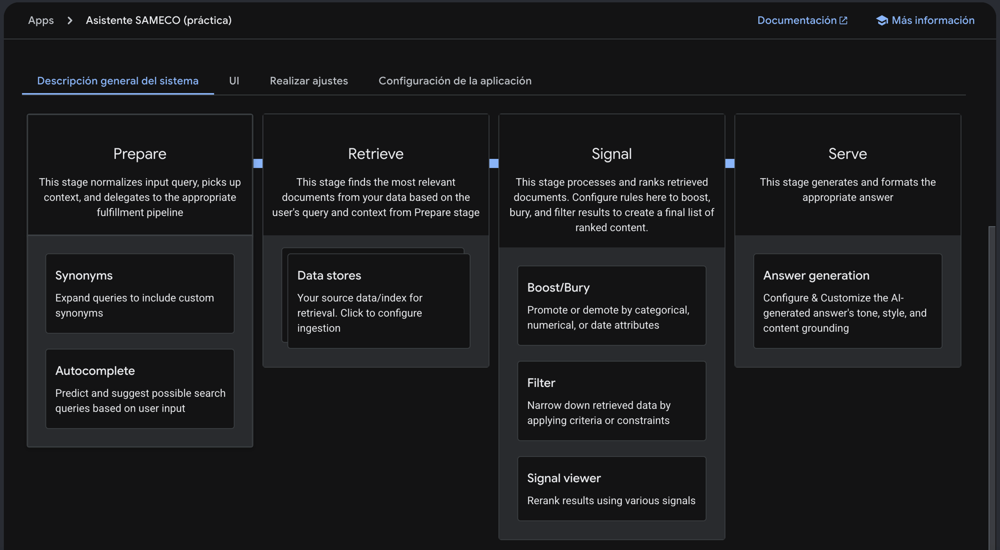
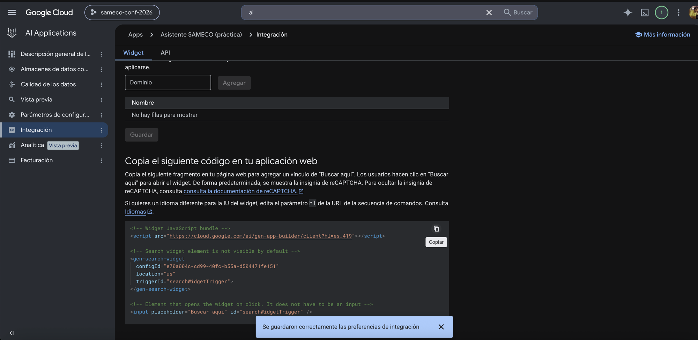

# Instructivo A — Asistente Q&A con app de búsqueda y widget oficial

Construís un asistente conversacional con citas sobre tus propios documentos,
**sin escribir código**, y lo publicás en una página web con el widget oficial.
Producto: **AI Applications** (en docs: "Agent Search"; motor: Discovery Engine API).
Tiempo estimado: 2–3 horas + esperas de indexación. Verificado: ago-2026.

> **Los dos identificadores del proyecto** (no confundirlos):
> - **Project ID** (texto, lo elegís vos): p. ej. `sameco-conf-2026`
> - **Número de proyecto** (lo asigna Google): p. ej. `130139429439`
> Ambos aparecen en la portada de la consola. Algunas pantallas piden uno, otras el otro.

## Paso 1 — Cuenta y proyecto

1. Entrá a `console.cloud.google.com` con tu cuenta Google y aceptá los términos.
2. Activá la **prueba gratuita**: USD 300 por 90 días (pide tarjeta, hace un hold de
   USD 0–1, no cobra; solo cuentas nunca-pagas). Cubre todo lo de este instructivo.
3. Creá un proyecto nuevo y **anotá el Project ID y el número**.

## Paso 2 — Presupuesto y alarma (antes que nada)

1. Menú ☰ → **Facturación** → **Descripción general**.
2. En el panel **"Crea una alerta de presupuesto"** (columna derecha): elegí el
   importe personalizado, escribí **$20** y clic en **Crear**. Vas a recibir
   mails cuando el gasto se acerque o supere ese monto.
3. (Alternativa con más control: **Presupuestos y alertas** → Crear presupuesto,
   permite umbrales al 50/90/100% y elegir proyecto específico.)
4. Con los free tiers (ver final) el gasto real del ejercicio debería ser
   centavos; la alarma es para dormir tranquilo.

## Paso 3 — Habilitar el producto

1. En el buscador de la consola escribí **"AI Applications"** y elegí el
   producto (URL directa: `console.cloud.google.com/gen-app-builder/`).
   No confundir con "Vertex AI (Agent Platform)", que aparece al lado en los
   resultados: ese es el producto del Instructivo B.

   

2. Clic en **"Continuar y activar la API"** — habilita la Discovery Engine API sola.

## Paso 4 — Subir los documentos a Cloud Storage

El bucket es el "depósito" del que la biblioteca lee. Los agentes/apps nunca apuntan
al bucket directamente: apuntan a un datastore que lo indexa (Paso 5).

1. Menú ☰ → **Cloud Storage** → **Buckets** → Crear.

   

   > Ojo con el orden: el asistente de "Crear almacén de datos" NO crea buckets —
   > solo apunta a uno existente. El bucket se crea acá primero, y después se
   > vuelve al asistente del datastore (Paso 5).
   - Nombre único global (p. ej. `miproyecto-docs-<tunombre>`).
   - Región: `us-east1` (anotá cuál elegiste — el datastore debe ser compatible:
     una región de EE.UU. queda cubierta por la multi-región `us`).
   - **Todo lo demás con los defaults.** NO activar "espacio de nombres jerárquico"
     (es permanente y no aporta acá) ni "Rapid Cache" (solo suma costo).
2. Dentro del bucket, creá las carpetas por dominio (p. ej. `evento/` e `historico/`)
   y subí los documentos por el navegador (botón Upload).

Alternativa por línea de comandos (opcional): instalá gcloud CLI
(https://docs.cloud.google.com/sdk/docs/install-sdk?hl=es-419) y usá
`gcloud storage cp <archivos> gs://<bucket>/<carpeta>/`.

## Paso 5 — Crear los datastores (las "bibliotecas")

En AI Applications → **Almacenes de datos** → **Crear almacén de datos**, una vez
por dominio (en el ejemplo, dos: evento e histórico):

1. Fuente: **Cloud Storage** → "Agregar fuente de datos" → Carpeta → navegá
   hasta la carpeta correspondiente.

   
2. Tipo de datos: **Documentos** (no estructurados). "Documentos con metadatos (RAG)"
   es el mismo tipo con fichas adjuntas — se puede migrar después reimportando.
3. Nombre del datastore: elegilo con cuidado — **el ID se genera del nombre y no
   se puede cambiar después**.
4. **Opciones de procesamiento de documentos** (desplegable al final):
   - Default: **Digital Parser** — suficiente para Word/PDF modernos con texto.
   - Overrides por formato (recomendado si hay PDF complejos o PPT): **Layout
     Parser** para PDF y PPTX — es el recomendado para RAG, entiende la
     estructura del documento (costo Document AI aparte, ~$10/1.000 págs).
   - Para escaneos puros alcanza el **OCR Parser** (solo PDF, ~$1,50/1.000 págs,
     free tier 1.000/mes).

   

5. Ubicación: anotala (p. ej. `us`) — la vas a necesitar en cualquier integración.
6. La indexación tarda de minutos a una hora (pestaña Activity). El **ID** de
   cada datastore se ve en la lista de Almacenes de datos (p. ej.
   `biblioteca_1786499215910`) — se ve también en la captura del Paso 6.

> Problema conocido: si la creación desde Cloud Storage falla, verificá que el
> bucket exista de antemano (creado en el Paso 4) — es el workaround oficial.

## Paso 6 — Crear la app (el "agente bibliotecario")

1. AI Applications → **Apps** → **Crear app** → tarjeta **"Búsqueda
   personalizada (general)"** → Crear. (No confundir con "Gemini Enterprise",
   la tarjeta de al lado: ese es el portal por asiento.)

   

2. En Configuración, dejá activadas las dos casillas: **"Funciones de la edición
   Enterprise"** y **"Respuestas generativas"** — sin la segunda no hay
   respuestas redactadas con citas ni búsquedas con seguimientos. Poné el
   nombre de la app.

   

3. En **Datos / Almacenes de datos**: tildá TODOS los que creaste. Acá se
   materializa el diseño "1 agente + N bibliotecas": un solo asistente decide
   dónde buscar. (En esta pantalla se ven los IDs y la ubicación de cada
   datastore — anotalos.)

   

**Bonus — qué acabás de armar:** al entrar a la app, la pestaña "Descripción
general del sistema" muestra el pipeline por el que pasa cada pregunta:
**Prepare** (entender la consulta: sinónimos, autocompletado) → **Retrieve**
(buscar en tus datastores) → **Signal** (ordenar, priorizar y filtrar
resultados) → **Serve** (redactar la respuesta con citas). Es el diagrama de
"buscar primero, responder después" — la plataforma lo hace todo sola.

## Paso 7 — Configurar el comportamiento

En la app → **Parámetros de configuración** → pestaña **IU**:

1. **Tipo de búsqueda: "Búsqueda con seguimientos"** — esto lo hace conversacional
   (recuerda el hilo, admite repreguntas). El default "con una respuesta" trata
   cada pregunta como independiente.
2. Elegí el modelo para las respuestas (el Flash vigente alcanza y es el más barato).
3. En **"Personaliza la respuesta" (Instrucciones)** cargá el prompt. Las 3 reglas
   que no pueden faltar: cuándo buscar (siempre), cómo citar (formato fijo),
   y qué hacer si no está (fallback con derivación). Ejemplo:

   > Sos el asistente oficial de [ORGANIZACIÓN]. Respondé solo con la información
   > de los documentos. Si no está, decí "no cuento con esa información" y sugerí
   > escribir a la organización. Español, breve, citando la fuente.

4. **Guardar y publicar.**

> 📸 _[Captura: configuración con "Búsqueda con seguimientos" e instrucciones]_

## Paso 8 — Probar con un set de preguntas fijo

En el panel de prueba de la misma pantalla (o en **Vista previa**):

- Armá 15–20 preguntas que cubran los 4 tipos: **factuales**, **de síntesis**
  (cruzan documentos), **fuera de la base** (la respuesta correcta es "no lo sé" —
  las "canarias" de alucinación) y **ambiguas**.
- OJO al probar memoria: la caja "Hacer una pregunta **nueva**" arranca sesión de
  cero a propósito. El hilo se continúa en **"Solicitar una pregunta adicional"**.
- Anotá cada respuesta: correcta / incompleta / inventada / fallback correcto.
  Iterá **un solo cambio por vez** (una instrucción o un documento) y volvé a correr.

## Paso 9 — Publicar el widget

1. App → **Integración** → pestaña **Widget**.
2. Tipo de autorización: **Acceso público** (posible porque la fuente es Cloud
   Storage sin ACL; un datastore de Drive no lo permite).
3. Agregá el dominio a la lista permitida: para probar, `localhost` (sin puerto,
   sin `http://`). **Guardar**.
4. Copiá el snippet (`<script>` + `<gen-search-widget>`) en tu página HTML.
5. Servila por HTTP — **nunca abrir el archivo con doble clic** (`file://` no es
   un dominio y el widget lo rechaza): `python3 -m http.server 8500` y abrir
   `http://localhost:8500`.

> ⏳ **La allowlist tarda HASTA 30 MINUTOS en aplicarse** (lo dice la propia
> pantalla). Si el widget dice "no se autorizó la configuración" con todo bien
> configurado: esperar y recargar. No re-guardar a cada rato: no acelera nada.

En producción: el webmaster pega el mismo snippet en el sitio real y se
allowlistea ese dominio. El estilo del panel del widget NO se personaliza por CSS.

## Costos de referencia (verificado ago-2026)

| Concepto | Free tier | Después |
|---|---|---|
| Consultas | 10.000/mes | Enterprise $4/1.000 (incluye respuestas generativas core) |
| Respuestas avanzadas | — (no cubiertas) | +$4/1.000 desde la primera |
| Índice | 10 GiB/mes | $5/GiB/mes |
| OCR | 1.000 págs/mes | $1,50/1.000 págs |

## Errores típicos

| Síntoma | Causa probable |
|---|---|
| 403 / PERMISSION_DENIED al crear algo | API no habilitada en el proyecto |
| No aparecen respuestas generativas | Faltó el toggle de funciones avanzadas de LLM (Paso 6) |
| El escaneo no aparece en respuestas | Datastore creado con digital parser; recrear con OCR parser |
| Widget no carga | Dominio no allowlisteado, `file://`, o propagación (hasta 30 min) |
| "No se acuerda" de la pregunta anterior | Se usó "pregunta nueva" en vez del hilo de seguimiento |
| Descarga de un documento citado falla al público | El bucket es privado: el índice responde igual, pero el archivo original requiere permisos (hacer públicos los objetos, o servir los documentos desde el sitio web) |
| El documento nuevo no impacta | La reindexación no es instantánea (ver Activity) |
