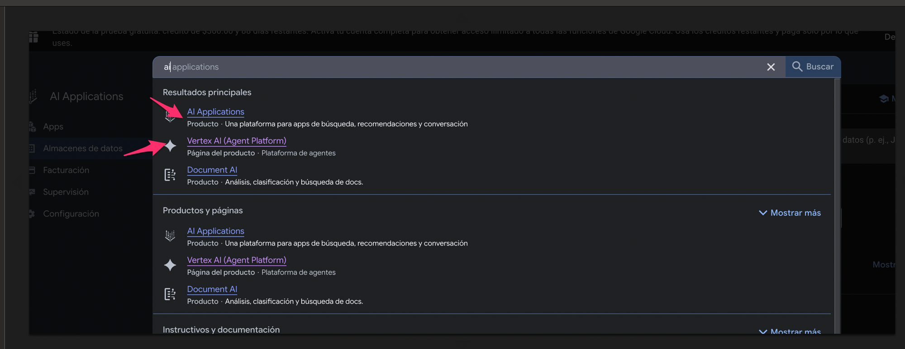
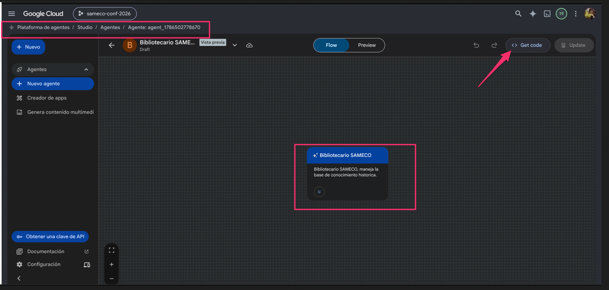
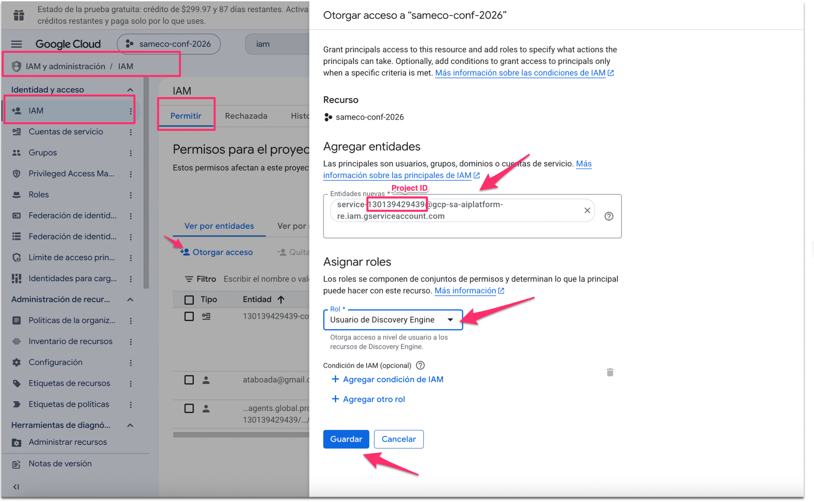
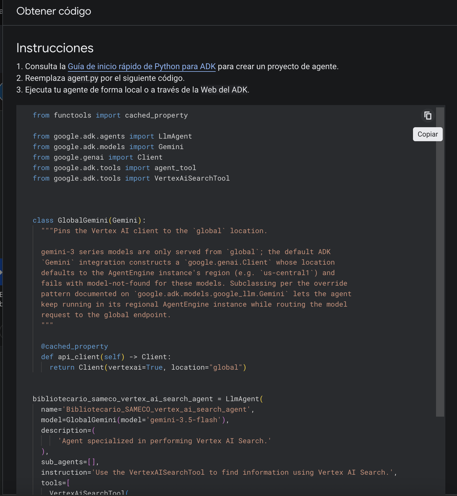

# Instructivo B — Agente conversacional propio con Agent Studio

Construís un **agente conversacional** (saluda, repregunta, desambigua) sobre los
mismos datastores del Instructivo A, usando **Agent Studio** (Plataforma de
agentes, ex Vertex AI). Verificado: ago-2026.

**Requisito previo:** haber completado el Instructivo A hasta el Paso 5 inclusive
(proyecto + bucket + datastores indexados). Este instructivo NO reemplaza al A:
son dos "mostradores" distintos para la misma biblioteca — ver la comparación final.

> **Los dos identificadores del proyecto** (acá se usan LOS DOS):
> - **Project ID** (texto): p. ej. `sameco-conf-2026` → va en la herramienta (Paso 3)
> - **Número de proyecto** (numérico): p. ej. `130139429439` → va en la cuenta de
>   servicio de IAM (Paso 4)

## Paso 1 — Crear el agente

1. En el buscador de la consola: **"Agent Studio"** o **"Vertex AI (Agent
   Platform)"** (o Menú ☰ → Plataforma de agentes → **Studio** → **Agentes**).
   En los resultados aparece también "AI Applications" — ese es el producto del
   Instructivo A, no este.

   
2. **Crear agente**. Nombre y descripción cortos (la descripción la usa la
   plataforma para saber qué hace el agente).



## Paso 2 — Las instrucciones

En el panel de detalles del agente, campo **Instrucciones**. La estructura que
funciona: rol + las 3 reglas de RAG + manejo de ambiguas + tono + límites.
Plantilla probada (adaptá organización y dominios):

```
Sos el Bibliotecario de [ORGANIZACIÓN]: el asistente oficial sobre [DOMINIOS].

REGLAS:

1. CUÁNDO BUSCAR: Antes de responder cualquier pregunta, buscá SIEMPRE en la
   base de conocimiento (herramienta de datastore). Nunca respondas desde tu
   conocimiento general ni de memoria, aunque creas saber la respuesta.

2. CÓMO RESPONDER: Basá cada afirmación solo en lo que devolvió la búsqueda.
   Al final de cada respuesta indicá la fuente con el formato:
   (Fuente: [nombre del documento]). Si usaste varios documentos, citá cada uno.

3. SI NO ESTÁ: Si la búsqueda no devuelve la información, respondé exactamente:
   "No cuento con esa información en los documentos de [ORGANIZACIÓN]. Te
   sugiero escribir a la organización." No inventes datos, nombres ni cifras.

4. PREGUNTAS AMBIGUAS: Si la pregunta es ambigua (por ejemplo "¿y los costos?"),
   hacé UNA repregunta breve para aclarar, o respondé lo más relevante indicando
   qué interpretaste.

TONO: Español rioplatense, cordial y profesional. Respuestas breves: 3 a 5
oraciones, o una lista corta si enumera varios trabajos.

LÍMITES: Solo temas de [ORGANIZACIÓN]. Ante cualquier otro tema, decliná
amablemente y ofrecé ayudar con lo que sí cubrís.
```

Errores comunes a evitar en las instrucciones:
- **No limitar por caracteres** ("máximo 100 caracteres" mutila las respuestas);
  limitá por oraciones.
- La regla de búsqueda va **en imperativo y absoluta** ("buscá SIEMPRE") — sin
  eso el modelo responde de memoria cuando cree saber, y ahí nace la alucinación.
- El fallback con **texto exacto**: si queda a criterio del modelo, cada vez
  inventa una disculpa distinta (o peor, una respuesta).

Elegí también el **modelo** (p. ej. Gemini 3.5 Flash).

## Paso 3 — Conectar la biblioteca (herramienta de datastore)

Un agente nunca apunta al bucket: consume el **datastore** ya indexado.

1. En el panel del agente, sección **Herramientas** → **+** → tipo **Data store**.
2. Completá (valores de ejemplo del sandbox SAMECO):

| Campo | Valor | Dónde encontrarlo |
|---|---|---|
| Project ID | `sameco-conf-2026` | Portada de la consola |
| Ubicación | `us` — **¡no `global`!** debe coincidir con la del datastore | AI Applications → Almacenes de datos (columna Ubicación) |
| ID de la colección | `default_collection` | Es la default de todo lo creado por consola |
| ID del almacén de datos | `biblioteca_1786499215910` | AI Applications → Almacenes de datos (columna ID) |

3. **Una herramienta por datastore**: si querés que también busque en un segundo
   datastore, agregá otra herramienta igual con el otro ID.

> 📸 _[Captura: formulario de la herramienta completo]_

## Paso 4 — El permiso que falta (LA causa del error típico)

Si probás el agente ahora, da **error de permisos**: Agent Studio ejecuta las
herramientas con una cuenta de servicio administrada por Google, y esa cuenta
no tiene acceso a tus datastores. El fix:

1. Menú ☰ → **IAM y administración** → **IAM** → **Otorgar acceso**.
2. Principal (reemplazá por TU número de proyecto):

   ```
   service-130139429439@gcp-sa-aiplatform-re.iam.gserviceaccount.com
   ```

3. Rol: **Discovery Engine User** (en español: "Usuario de Discovery Engine").
4. Guardar. El cambio aplica en 1–2 minutos.



> Nota sobre la captura: el número resaltado dentro de la cuenta de servicio es
> el **número de proyecto** (no el Project ID de texto) — ver el recuadro de
> identificadores al inicio de este instructivo.

## Paso 5 — Probar en Preview

Botón **Preview** del agente. Qué verificar:

- Que **invoca la herramienta** antes de responder (se ve el paso
  `VertexAISearchAgent` en la conversación) — es la visualización literal de
  "buscar primero, responder después".
- El flujo conversacional: saludo → pregunta amplia ("¿tenés documentos sobre
  Lean?") → el agente **repregunta** ("¿industrial o de salud?") → respuesta
  con fuente.
- Las canarias: preguntas cuya respuesta correcta es el fallback exacto.

> 📸 _[Captura: conversación en Preview con la invocación de la herramienta]_

## Paso 6 — Qué hay (y qué NO hay) después del Preview

- **No existe widget embebible** para estos agentes. "Get code" genera código
  Python del **Agent Development Kit (ADK)**: un agente raíz con tus
  instrucciones que delega la búsqueda en un sub-agente con `VertexAiSearchTool`.

  

  (El botón **Get code** está arriba a la derecha del lienzo del agente — se ve
  en la captura del Paso 1.)
- Para ponerlo en una página web hay que **desarrollar**: deployar el agente
  (Agent Runtime) o servirlo con un backend propio + una interfaz de chat +
  credenciales de servicio. Eso es un proyecto de desarrollo, no un snippet.
- Para jugar localmente con el código generado: `pip3 install google-adk` y
  `adk web` en la carpeta del agente (requiere gcloud CLI autenticado:
  `gcloud auth application-default login`).

## La comparación (el porqué de los dos instructivos)

| | A: App de búsqueda + widget | B: Agente de Agent Studio |
|---|---|---|
| Publicar en una web | Pegar un snippet | Desarrollo propio (backend + UI) |
| Conversacional | Sí (modo seguimientos) | Sí, con más control (saluda, guía) |
| Repreguntar / desambiguar | Limitado | Sí, por instrucciones |
| Acciones (inscribir, integrar sistemas) | No | Sí (herramientas custom, ADK) |
| Mantenimiento por no técnicos | Sí (subir documento y listo) | No (requiere desarrollador) |
| Costos | Free tier 10k consultas/mes | Por uso de modelo + runtime |
| Cuándo elegirlo | Q&A sobre documentos, ya | Cuando el agente deba HACER cosas |

Moraleja: misma biblioteca, dos mostradores. Para un asistente Q&A operado por
un equipo no técnico, el camino A entrega valor hoy; el camino B es la fase 2
cuando haga falta que el agente ejecute acciones.
