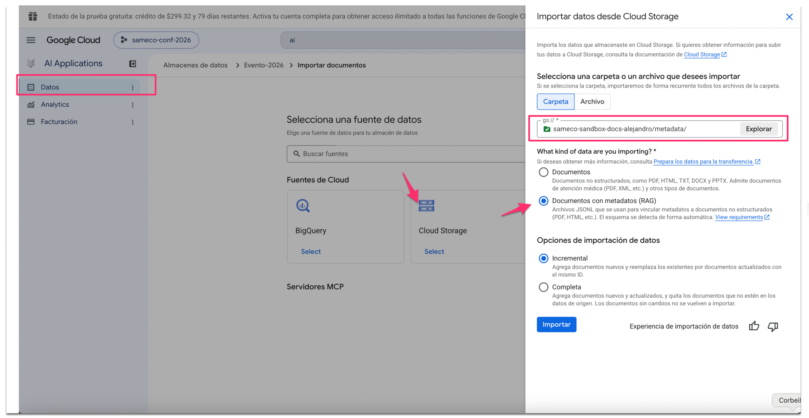

# Instructivo D — Enriquecimiento con fichas de metadatos ("fine-tuning" del RAG)

**Requisito previo:** Instructivo A completado (datastores indexados). Este paso
es parte del entregable: convierte un asistente que "encuentra texto" en uno que
entiende años, autores, sectores — y que puede ofrecer el **link de descarga**
de cada documento que cita.

**Aclaración de vocabulario antes que nada:** esto NO es fine-tuning en el sentido técnico (no se reentrena ningún modelo). Es **enriquecimiento de datos**: análisis semántico previo de cada documento + ficha de metadatos adjunta. Es la palanca correcta y barata para mejorar un RAG gestionado — y si en una sesión alguien pregunta por "fine-tuning", esta es la respuesta que corresponde dar.

**Dónde vive en el curso: Sesión 2** (preparación del material y carga), con esta división:
- **En sesión** (lámina "Fortalecer la biblioteca: la ficha de cada documento"): el equipo entiende qué es una ficha y por qué mejora las búsquedas; completa los datos (año, autor, sector, tema) en la planilla del inventario que arrancó en la Sesión 1.
- **Entre sesiones (trabajo tuyo)**: correr el pipeline de este documento, cruzar lo generado por IA con la planilla del equipo, e importar.
- El **beneficio aparece en la Sesión 3**: preguntas como "¿qué trabajos hay de 2018?" o "¿hay algo del sector alimentario?" dejan de depender de que la palabra figure en el texto. Además habilita Boost/Bury y Filter (etapa "Signal" de la app).

## Por qué funciona

Además del documento, el datastore puede guardar su ficha (`structData`): título, año, autores, sector, tema, resumen. Con ficha:
- La recuperación cruza por atributos, no solo por texto ("trabajos de 2018" aunque el año solo esté en el nombre del archivo).
- Los campos quedan disponibles para **Boost/Bury y Filter** en la etapa Signal de la app (priorizar evento sobre histórico, filtrar por año, etc.).
- El resumen le da al retrieval un texto limpio y denso aunque el documento sea un escaneo mediocre.

## El pipeline (variante batch, la recomendada)

Script: `../scripts/generar_fichas.py`. Trabaja en **dos fases de IA** (dos
casos de uso distintos de Gemini en un mismo pipeline):

- **Fase 1 — el bibliotecario**: lee cada documento y genera su ficha
  individual (título, año, autores, sector, tema, resumen, etiquetas). Los PDF
  van enteros por visión (lee incluso escaneos sin OCR previo); los DOCX se
  convierten a texto localmente (Gemini no acepta DOCX adjunto).
- **Fase 2 — el curador**: ve TODAS las fichas juntas y normaliza la
  taxonomía: unifica sinónimos bajo una forma canónica (misma etiqueta =
  mismo string exacto), en minúsculas y castellano. Sin esta fase, cada
  documento etiqueta por su cuenta ("5S" / "cinco eses" / "orden y limpieza")
  y los filtros de la etapa Signal se vuelven inservibles.

Detalles operativos del script: deduplica documentos que estén en dos formatos
(ficha el .docx/.pdf y saltea el .md gemelo), espacia las llamadas para la
cuota del free trial (~5 req/min) y reintenta ante 429.

Paso a paso:

1. Recorre los documentos del bucket (carpetas `evento/` e `historico/`).
2. Le da cada archivo **entero** a Gemini Flash con esquema de salida forzado (JSON): título, año, autores, sector, tema, resumen. Gemini es multimodal: **lee también los escaneos** (no hace falta OCR previo para la ficha). La instrucción prohíbe inventar: lo que no consta queda vacío.
3. Escribe un `.jsonl` por carpeta con el formato de "Documentos con metadatos (RAG)":
   ```json
   {"id": "trabajo-2018-5s", "structData": {"titulo": "…", "anio": 2018, "url": "https://…/archivo.docx", …}, "content": {"mimeType": "application/…", "uri": "gs://bucket/historico/archivo.docx"}}
   ```

### El campo `url`: el link de descarga público

La ficha lleva, además de los datos bibliográficos, la **URL pública de
descarga** del documento. Por qué importa: la URI interna (`gs://…`) no le
sirve al público, y con el bucket privado solo pueden descargar quienes tengan
permisos de IAM. Con el campo `url` en la ficha:

- El asistente puede ofrecer "Descargar: [título](url)" en sus respuestas
  (instrucción: *"al citar un documento, incluí el campo url de su ficha como
  enlace de descarga"*).
- La URL puede apuntar a donde convenga: objetos públicos del bucket
  (`https://storage.googleapis.com/BUCKET/ruta`) o — mejor para producción —
  a los documentos ya publicados en el **sitio web de la organización**, con
  el bucket de indexación siempre privado.
- El script la genera solo (config `URL_PUBLICA_BASE`); si un documento no
  debe ser descargable, se deja su `url` vacía.
4. **Revisión humana de las fichas** (en SAMECO: contra la planilla del equipo). Este paso no se automatiza: es donde el criterio agrega valor.
5. Importar: datastore → **Import data** → Cloud Storage → **"JSONL con metadatos"** → modo **FULL**.



   Así se ve el formulario: pestaña **Datos** del datastore → Importar → Cloud
   Storage, apuntando a la carpeta `metadata/` del bucket (no a las carpetas de
   documentos) y con el tipo **"Documentos con metadatos (RAG)"** elegido — el
   esquema del JSONL se detecta solo. Ojo con la última opción: en la captura
   quedó marcada "Incremental", pero para esta primera importación con fichas
   corresponde **"Completa"** (FULL), por el tema de los IDs que se explica
   abajo.

### Requisitos (una vez)

```bash
pip3 install --user google-cloud-storage google-genai
gcloud auth application-default login
# + habilitar la Vertex AI API en el proyecto (la consola lo ofrece al primer uso)
# + editar BUCKET en el script
```

Costo: centavos (Flash ≈ $0,30/1M tokens de entrada; verificado ago-2026).

## Detalles verificados que evitan tropiezos (ago-2026)

- **No hay que cambiar el tipo de datastore**: "Documentos" y "Documentos con metadatos" son el mismo tipo (no estructurado); cambia solo el formato de importación. Se puede agregar metadata a un datastore existente reimportando.
- **El cuidado de los IDs**: los documentos importados "sin metadatos" recibieron IDs autogenerados. El import incremental hace upsert por ID → con IDs nuevos duplicaría. Por eso: **modo FULL** con el JSONL cubriendo todos los documentos (lo que no está en el JSONL se elimina del datastore).
- Los `.jsonl` conviene subirlos al bucket **fuera** de las carpetas de documentos (p. ej. `gs://bucket/metadata/`), para que no se indexen como contenido.
- Tras importar, en la pestaña **Schema** del datastore se ajusta qué campos son filtrables/recuperables (agregar campos nuevos es retrocompatible).
- Verificación de que pagó: correr el set de preguntas y comparar "¿qué trabajos hay de 2018?" y "¿hay algo del sector alimentario?" antes/después.

## Videos de YouTube: la biblioteca audiovisual

El datastore no indexa videos — indexa texto. Pero **Gemini puede mirar un
video de YouTube directamente por URL** (sin descargarlo) y producir su
documento de biblioteca. Script: `../scripts/generar_transcripciones.py`:

1. El equipo lista las URLs en `videos.txt` (una por línea).
2. Por cada video, Gemini genera: ficha (título, oradores, año, tema,
   etiquetas) + resumen + **secciones con marca de tiempo** cubriendo todo lo
   hablado — fiel al contenido, sin agregar información externa.
3. Salida: un `.md` por video (a subir a `gs://BUCKET/videos/`) y
   `videos.metadata.jsonl` con las fichas, donde **`url` = el link de YouTube**
   y `tipo_material` = "video". El asistente responde con lo dicho en la charla
   y ofrece "Ver el video" con el link (y el minuto, gracias a los timestamps).

Probado con un video real del canal de SAMECO (~28 min): 10 secciones con
timestamps correctos, oradores identificados por nombre, resumen fiel.
Costo: centavos por video con Flash.

Cuidados: (a) para videos de **terceros**, indexar solo ficha + resumen breve
con link, no transcripción completa; (b) charlas muy largas → el resumen por
secciones indexa mejor que la transcripción literal; (c) misma cuota de
free trial que el resto (el script ya espacia las llamadas).

En el inventario de la Sesión 1, esto agrega una categoría al semáforo:
verde (texto limpio) / amarillo (escaneos → OCR) / rojo (láminas → describir)
/ **azul (videos → transcribir)** — tarea del consultor entre sesiones.

## Variante automática (fase 2, NO para el go-live)

"Que la ficha se genere sola cuando se sube un documento": **Cloud Run + trigger de Eventarc** sobre el bucket, con el mismo análisis adentro, importando directo al datastore. Queda documentada como fase 2 porque: (a) suma piezas que mantener (permisos, reintentos, fallas silenciosas), (b) el volumen de SAMECO no la justifica, y (c) elimina el paso de revisión humana de la ficha. Se reevalúa si el archivo histórico crece a cientos de documentos por mes.
